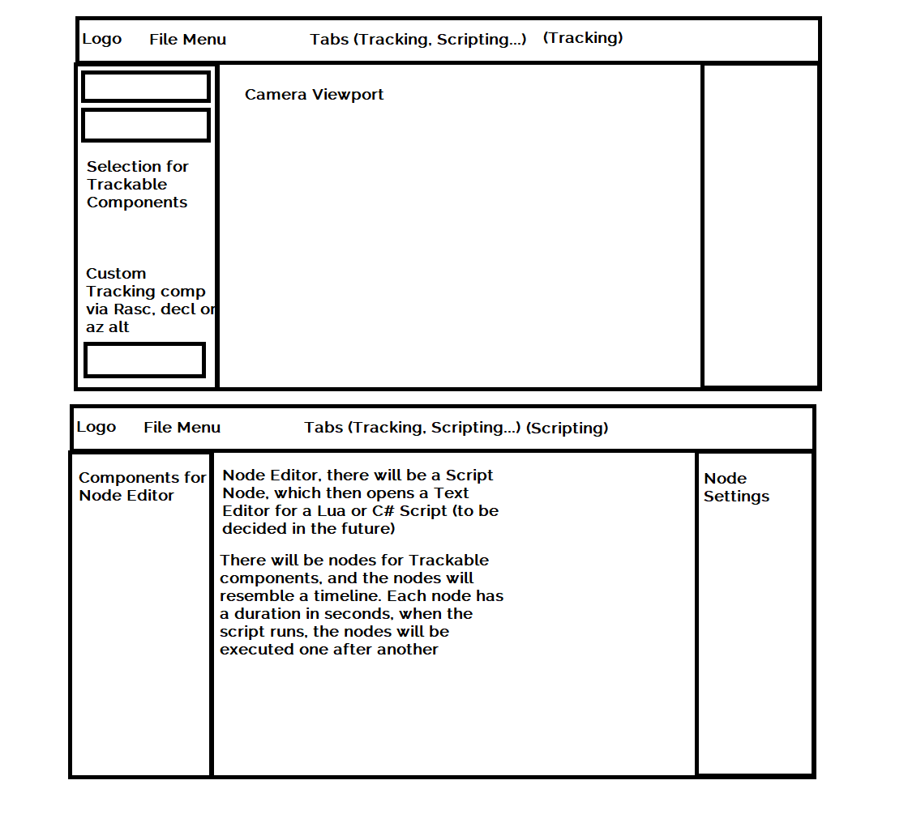

# StarTracker - Concept :telescope: 

For our diploma thesis, we chose a project that covers many aspects including the following:

 - Programming
 - Mathematics
 - Physics
 - Electronics
 - Engineering

## Motivation

Our goal is to provide an affordable easy to use product for astrophotography hobbyists that achieves stunning performance for a reasonable price.

To achieve this goal we are relying on a simple, but robust 3d-printed structure, a well thought through pcb, controlled by an efficient but extensive collection of C++ code.

## Implementation 

The C++ code is split up into a microcontroller-interface, a graphics framework and an ephemeris-computation framework.

For the microcontroller-interface, we developed a robust communication protocol for transferring data over a serial interface.

The graphics framework provides an abstraction layer for OpenGL and ImGui, which enables one to perform modifications to the graphical user interface of the program.

The ephemeris-computation framework uses a set of equations for computing the position of a given planet or star. 

### Microcontroller-Protocol

Protocol ideas:

```
HEADER:     
FLAG        MOVE     => instruction to move to angles
            CONF     => sets the current position
            ORIGIN   => stop current movement and return to angle 0, 0 
            SLEEP    => send stepper-motor x to sleep
            WAKEUP   => wake up stepper-motor x
SIZE        Content size in bytes 

BODY:       (dependent on the flag)
CONTENT     MOVE     => list of 4 byte float angles -> last 4 bytes are the timespan as 4 byte float
            STOP     => empty
            ORIGIN   => empty
            SLEEP    => list of 1 byte integers for the stepper motors, can only be 0,1 or 2
            WAKEUP   => list of 1 byte integers for stepper motors that need to be woken up, can only be 0,1 or 2
```

### Random ideas

Creating an step by step instruction on how to build and print StarTracker when you first start the program.

#### Editor Concept

The following image shows a design idea for the editor user interface. The Editor will consist of a File Menu, and Tabs for Tracking, Scripting, Image Manipulation and a Construction Guide. 

##### Astronomical Calculations, Graphing

Graph Position vs Time, compare to other objects, calculate when Planet will be visible, calculate closest encounter between two Objects in specified timespan.

##### Tracking

The Tracking Tab consists of a Panel for all the Trackable Components, e.g. supported celestial bodies. There will be an option to add a custom trackable component, where right ascension and declination or azimuth and altitude can be specified by the user. A trackable component will consist of an Image of the celestial body, the name, and the current position data. There will probably be a flag if the component is currently visible to the observer or not. 

The Tracking Tab also consists of the Camera Viewport, which will render the live camera feed. The tab on the right will show Camera settings, Serial interface settings, and location settings.

##### Scripting

The Scripting Tab contains the Node Editor. There will be various Nodes for Trackable Components, Tracking Shots, user steered shots, and so on. There will also be a Scripting component, which will run a Lua Script or C# Script (still to be decided). The Panel on the right will display the node settings.




